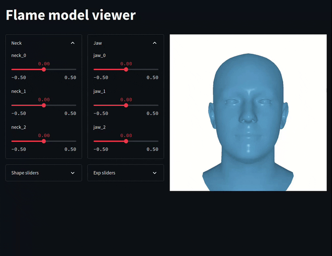

# Flame PyTorch3D
This code provides a quick visualization of the FLAME model. 
    

## Installation
You need to gather the flame data (FLAME 2020) from [MPI Flame webpage](https://flame.is.tue.mpg.de/download.php), login required.  
Put the downloaded data under data/FLAME2020. 

You will also need PyTorch3D for basic render, and streamlit for interactive purpose.   
Consult [PyTorch3D](https://github.com/facebookresearch/pytorch3d/blob/main/INSTALL.md) installation page on how to install it.   
streamlit can be installed with `pip install streamlit`.

To view the mesh in 3D, you can use open3D with `pip install open3d`.

## Running visualization/interaction
- generate a single image from FLAME  
  `python pytorch_visualize.py`.

- view FLAME mesh in 3D  
  `python open3d_visualize.py`

- interactively FLAME parameters   
  **CPU only** `streamlit run pytorch_interactive.py -- --img_size 256 --fov 40 --geneder generic --device cpu`  
  **CUDA** `streamlit run pytorch_interactive.py -- --img_size 1024 --fov 40 --geneder generic --device cuda`  

## Known Issues
In the interactive app
1. shading is not updated as the geometry changes.
2. CPU only is rather slow

## License
This code is released under the MIT license. 
The FLAME shape model is also released under a similar license. 

However, the rest of the MPI resource (texture space, SMPL-X model and repo) are released under non-commerical only license. 
Please respect their corresponding licenses when using this repo. 